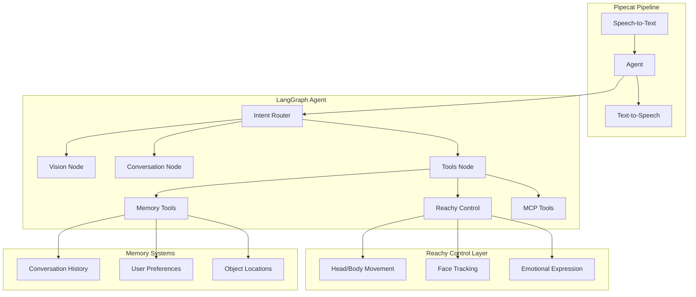

# Reachy Personal AI Assistant

A personal AI assistant powered by **LangGraph** controlling a **Reachy Mini Robot**. Features include:

- **Memory**: Remembers object locations and user preferences across sessions
- **Vision Understanding**: Sees and describes the environment through Reachy's camera
- **Face Tracking**: Maintains eye contact and follows user movement
- **Emotional Expression**: Expresses emotions through movements and antenna positions
- **Tool Calling**: Semantic control of robot movements and external services
- **MCP Integration**: Connect to calendars, files, and other data services


## Architecture

The system uses **LangGraph** for stateful, memory-enabled agent orchestration:



### Components

1. **Reachy Mini Daemon** - Controls the robot hardware (or simulation)
2. **Bot Service** - Pipecat pipeline with STT/TTS and LangGraph integration
3. **LangGraph Agent** - Stateful agent with memory, tools, and vision

### Backend Options

- **LangGraph** (default): Full-featured agent with memory and MCP support
- **NAT** (legacy): Original NeMo Agent Toolkit router

## Prerequisites

- Python 3.11+
- [uv](https://github.com/astral-sh/uv) package manager
- NVIDIA GPU with sufficient VRAM (or use cloud APIs)
- ElevenLabs API Key (for text-to-speech)

### Optional
- MediaPipe or OpenCV for face detection
- MCP server tools (Node.js/npm)

## Setup Instructions

### 1. Clone and Navigate to Repository

```bash
cd /path/to/reachy-personal-assistant
```

### 2. Create Environment File

Create a `.env` file in the main directory:

```bash
# Required
ELEVENLABS_API_KEY=your_elevenlabs_api_key

# For local models (default)
MAIN_MODEL_URL=http://localhost:8002/v1
ROUTER_MODEL_URL=http://localhost:8003/v1

# Or for cloud APIs
OPENAI_API_KEY=your_openai_key  # Optional, for OpenAI models
NVIDIA_API_KEY=your_nvidia_key   # Optional, for NIM models

# MCP Integrations (optional)
GOOGLE_OAUTH_TOKEN=your_google_token  # For calendar
GITHUB_TOKEN=your_github_token        # For GitHub
```

### 3. Setup Bot Service with LangGraph

```bash
cd bot
uv venv
uv sync
```

### 4. Setup Agent (Optional - for NAT backend)

Only needed if using the legacy NAT backend:

```bash
cd nat
uv venv
uv sync
```

## Running the System

You'll need **two terminal windows** for the LangGraph backend (three for NAT).

### Quick Start (LangGraph - Recommended)

1. **Terminal 1 (Robot Daemon)**:
    ```bash
    ./start_daemon.sh
    ```
    *(Edit script to remove `--sim` for real hardware)*

2. **Terminal 2 (Bot Service with LangGraph)**:
    ```bash
    ./start_bot.sh --langgraph
    ```

That's it! The LangGraph agent is built into the bot service.

### Quick Start (NAT - Legacy)

1. **Terminal 1 (Robot Daemon)**:
    ```bash
    ./start_daemon.sh
    ```

2. **Terminal 2 (Bot Service)**:
    ```bash
    ./start_bot.sh --nat
    ```

3. **Terminal 3 (NAT Agent Service)**:
    ```bash
    ./start_agent.sh
    ```

---

### Manual Execution

#### Terminal 1: Start Reachy Mini Daemon

**For Linux:**
```bash
cd bot
uv run -m reachy_mini.daemon.app.main --sim --no-localhost-only
```

**For macOS:**
```bash
cd bot
uv run mjpython -m reachy_mini.daemon.app.main --sim --no-localhost-only
```

*Note: Remove `--sim` for real hardware.*

#### Terminal 2: Start Bot Service

```bash
cd bot
LLM_BACKEND=langgraph uv run --env-file ../.env python main.py
```

Features:
- LangGraph stateful agent with memory
- Vision understanding through robot camera
- Speech recognition and synthesis
- Face tracking and emotional expressions
- MCP server integration for external services

#### Terminal 3: Local Models (Optional)

Start vLLM containers for local inference:

```bash
./start_local_vllm.sh
```

This starts models on ports 8002 (main) and 8003 (router).

---

### Option: Run with Local Models (vLLM)

You can run the models locally using vLLM containers instead of relying on NVIDIA Cloud APIs.

1.  **Prerequisites**:
    *   Docker and Docker Compose installed.
    *   NVIDIA GPU with sufficient VRAM (approx 60GB for BF16 models).
    *   Hugging Face Token (for downloading models) in `.env` as `HUGGING_FACE_HUB_TOKEN`.

2.  **Start vLLM Containers**:
    Open a new terminal window:
    ```bash
    ./start_local_vllm.sh
    ```
    This will start 3 containers on ports 8002, 8003, and 8004.

3.  **Run NeMo Agent Service Locally**:
    Use the helper script with the `--local` flag in Terminal 3:
    ```bash
    ./start_agent.sh --local
    ```

## How It Works

1. **Vision & Audio Input**: The bot captures visual information and listens for speech
2. **Agent Processing**: The NeMo Agent router intelligently selects the appropriate model:
   - Text queries → Nemotron nano text model
   - Visual queries → Nemotron nano VLM
   - Action requests → REACT agent with tool calling
3. **Robot Actions**: Based on the agent's response, the bot executes movements, expressions, or speaks

## Demo

Check out `ces_tutorial.mp4` to see the system in action!

## Project Structure

```
reachy-personal-assistant/
├── agent/                      # LangGraph agent (NEW)
│   ├── graph.py               # Main StateGraph definition
│   ├── state.py               # Agent state schema
│   ├── config.py              # Configuration
│   ├── nodes/                 # Graph nodes
│   │   ├── router.py          # Intent classification
│   │   ├── conversation.py    # Chitchat handling
│   │   ├── vision.py          # Image understanding
│   │   └── tools.py           # Tool execution
│   ├── tools/                 # LangChain tools
│   │   ├── reachy_tools.py    # Robot control
│   │   ├── memory_tools.py    # Spatial/long-term memory
│   │   └── mcp_loader.py      # MCP server integration
│   └── memory/                # Memory systems
│       ├── spatial.py         # Object location memory
│       ├── long_term.py       # User preferences
│       └── emotional.py       # Emotional state
├── bot/                        # Pipecat pipeline
│   ├── main.py                # Main orchestration
│   ├── langgraph_llm.py       # LangGraph LLM service
│   ├── nat_vision_llm.py      # NAT LLM service (legacy)
│   └── services/              # Robot services
│       ├── reachy_service.py  # Robot connection
│       ├── camera_service.py  # Camera + face tracking
│       ├── moves.py           # Movement manager
│       └── processor.py       # Audio/command processing
├── mcp_servers/               # Custom MCP servers
├── nat/                        # NeMo Agent Toolkit (legacy)
├── SCRIPT.md                  # Demo interaction scripts
├── langgraph.json             # LangGraph CLI config
└── .env                       # API keys (create this)
```

## Key Features

### Memory System
- **Short-term**: Conversation history within sessions
- **Long-term**: User preferences persisted across sessions
- **Spatial**: Object locations organized by room/location

### Face Tracking
- Real-time face detection using MediaPipe or OpenCV
- Smooth head tracking to maintain eye contact
- Enabled via "look at me" command

### Emotional Expression
- Dynamic emotional states (happy, curious, excited, etc.)
- Physical expression through antenna movements
- Automatic emotion inference from conversation

### MCP Integration
- Connect to external services via Model Context Protocol
- Built-in support for memory and filesystem servers
- Easy addition of calendar, GitHub, and custom servers

## Dual GB10 Setup

For optimal performance, use two Dell Pro Max GB10 systems:

| GB10 System 1 (Primary) | GB10 System 2 (Inference) |
|-------------------------|---------------------------|
| Pipecat Pipeline        | Main VL Model (Qwen 30B)  |
| LangGraph Agent Server  | Vision Model              |
| Reachy Mini Daemon      | Face Detection Model      |
| Router Model (Phi-3)    |                           |

Configure by setting model URLs in `.env`:
```bash
MAIN_MODEL_URL=http://gb10-2:8002/v1
ROUTER_MODEL_URL=http://localhost:8003/v1
```

## Troubleshooting

- **No LangGraph response**: Ensure `LLM_BACKEND=langgraph` is set
- **Face tracking not working**: Install MediaPipe: `pip install mediapipe`
- **Memory not persisting**: Check checkpointer configuration
- **MCP tools missing**: Install adapters: `pip install langchain-mcp-adapters`
- **Robot connection issues**: Verify daemon is running before bot service

## Demo Scripts

See [SCRIPT.md](SCRIPT.md) for scripted demo interactions including:
- Greeting and introduction
- Spatial memory demonstrations
- Face tracking showcase
- Vision understanding examples
- Emotional expression demos

## Resources

- [LangGraph Documentation](https://python.langchain.com/docs/langgraph/)
- [Reachy Mini Robot](https://www.pollen-robotics.com/)
- [Model Context Protocol](https://modelcontextprotocol.io/)
- [NVIDIA Nemotron Models](https://build.nvidia.com/)
- [Pipecat Framework](https://github.com/pipecat-ai/pipecat)

