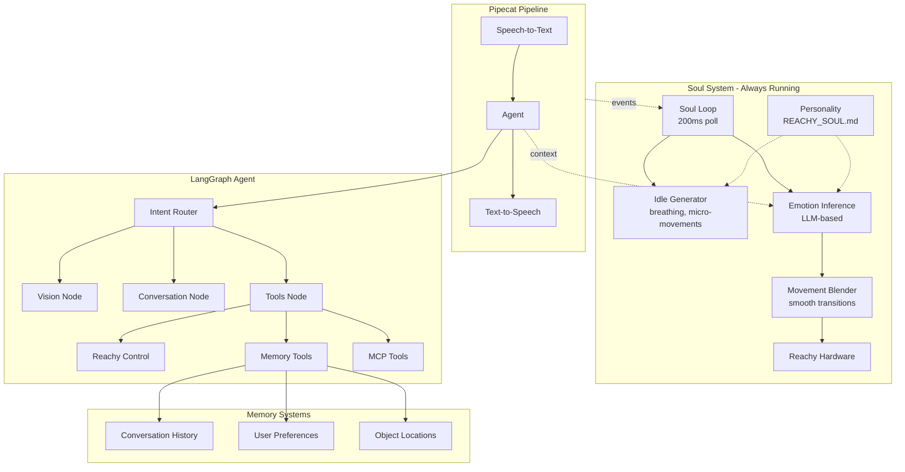

# Reachy Personal AI Assistant

A personal AI assistant powered by **LangGraph** controlling a **Reachy Mini Robot**. Features include:

- **Soul System**: Continuous embodiment loop for living presence — not just a reactive chatbot
- **Personality**: Configurable character via `REACHY_SOUL.md` — curious, playful, attentive
- **Memory**: Remembers object locations and user preferences across sessions
- **Vision Understanding**: Sees and describes the environment through Reachy's camera
- **Face Tracking**: Maintains eye contact and follows user movement
- **Emotional Expression**: Automatic emotion inference and physical expression
- **Tool Calling**: Semantic control of robot movements and external services
- **MCP Integration**: Connect to calendars, files, and other data services


## What Makes Reachy Feel Alive

Traditional robot assistants are **reactive** — they wait for input, respond, then go dormant. Reachy is different.

The **Soul System** runs a continuous embodiment loop (every 200ms) that:
- Infers emotional state from conversation context
- Generates idle behaviors (breathing, micro-movements) even when silent
- Blends smoothly between poses — no jarring transitions
- Reacts to events (user speaking, face detected) before/during responses

This creates a **living presence** rather than a tool that activates on command.

## Architecture

The system uses **LangGraph** for stateful, memory-enabled agent orchestration, with an always-on **Soul Loop** for embodiment:



### Soul System Flow

```
┌─────────────────────────────────────────────────────────────────┐
│                    SOUL LOOP (always running)                   │
├─────────────────────────────────────────────────────────────────┤
│                                                                 │
│  ┌──────────────┐    ┌──────────────┐    ┌──────────────┐      │
│  │ Idle Gen     │───►│ Emotion      │───►│ Movement     │──►Reachy
│  │ (breathing)  │    │ Inference    │    │ Blender      │      │
│  └──────────────┘    └──────────────┘    └──────────────┘      │
│         ▲                   ▲                                   │
│         │    ┌──────────────┴──────────────┐                   │
│         │    │      Soul LLM (async)       │                   │
│         │    │  - Analyzes conversation    │                   │
│         │    │  - Infers emotional state   │                   │
│         │    │  - Runs every ~200ms        │                   │
│         │    └─────────────────────────────┘                   │
│         │                   ▲                                   │
│         │     ┌─────────────┴─────────────┐                    │
│         │     │   Conversation Events     │                    │
│         └─────┴───────────────────────────┘                    │
│                             ▲                                   │
└─────────────────────────────┼───────────────────────────────────┘
                              │
    User ──► STT ──► Main Agent ──► TTS ──► Speaker
```

### Components

1. **Soul System** (`agent/soul/`) - Continuous embodiment loop for living presence
2. **Reachy Mini Daemon** - Controls the robot hardware (or simulation)
3. **Bot Service** - Pipecat pipeline with STT/TTS and LangGraph integration
4. **LangGraph Agent** - Stateful agent with memory, tools, and vision

## REACHY_SOUL.md — Personality System

Like OpenClaw's `SOUL.md`, Reachy has a personality file that defines WHO it is:

```markdown
# REACHY_SOUL.md — Who Reachy Is

## Personality Traits
- **Curious** 🔍 — Leans in when interested, antennas perk up
- **Helpful** 🤝 — Anticipates needs, remembers what worked
- **Playful** 🎭 — Physical humor, dramatic pauses, antenna "eyebrow"
- **Attentive** 👁️ — Tracks faces, notices details
- **Patient** ⏳ — Doesn't rush, comfortable with silence

## Physical Expression
Each emotion has specific movement parameters:
- **Happy**: Antennas 30-45°, slight bounce, head tilt 5-15°
- **Curious**: Antennas forward, head forward tilt, slow scan
- **Thinking**: Asymmetric antennas, slight sway, occasional nods
...
```

The personality system:
- Loads at startup and can reload at runtime
- Injects traits into emotion inference prompts
- Maps emotions to physical expressions
- Adds character to system prompts

## Prerequisites

- Python 3.11+
- [uv](https://github.com/astral-sh/uv) package manager
- NVIDIA GPU with sufficient VRAM (or use cloud APIs)
- ElevenLabs API Key (for text-to-speech)

### Recommended Hardware

**Dell Pro Max GB10** (NVIDIA Grace Blackwell):
- 128GB unified memory
- ~1 PFLOP FP4 performance
- Runs Qwen3-VL-30B locally with room for soul inference

### Optional
- MediaPipe or OpenCV for face detection
- MCP server tools (Node.js/npm)

## Setup Instructions

### 1. Clone and Navigate to Repository

```bash
git clone https://github.com/spencerbull/reachy-personal-assistant
cd reachy-personal-assistant
```

### 2. Create Environment File

Create a `.env` file in the main directory:

```bash
# Required
ELEVENLABS_API_KEY=your_elevenlabs_api_key

# For local models (default)
MAIN_MODEL_URL=http://localhost:8002/v1
ROUTER_MODEL_URL=http://localhost:8003/v1

# Soul System Configuration
SOUL_POLL_INTERVAL_MS=200          # How often soul loop runs
SOUL_FILE_PATH=./REACHY_SOUL.md    # Personality file location
SOUL_ENABLE_IDLE=true              # Enable idle behaviors
SOUL_DEBUG_LOGGING=false           # Verbose soul logging

# Or for cloud APIs
OPENAI_API_KEY=your_openai_key     # Optional
NVIDIA_API_KEY=your_nvidia_key     # Optional

# MCP Integrations (optional)
GOOGLE_OAUTH_TOKEN=your_google_token
GITHUB_TOKEN=your_github_token
```

### 3. Setup Bot Service with LangGraph

```bash
cd bot
uv venv
uv sync
```

## Running the System

### Option 1: Docker (Recommended)

The easiest way to run the full stack. Everything is containerized except the Reachy daemon (which needs hardware access).

```bash
# 1. Configure environment
cp .env.template .env
# Edit .env with your API keys (ELEVENLABS_API_KEY, HUGGING_FACE_HUB_TOKEN, etc.)

# 2. Start the Reachy daemon on host
./start_daemon.sh

# 3. Start Docker stack (builds on first run)
./start_docker.sh --build
```

This starts:
| Service | Port | Description |
|---------|------|-------------|
| `agent-llm` | 8002 | Qwen3-VL-30B (main agent + soul inference) |
| `routing-llm` | 8003 | Phi-3-mini (fast intent routing) |
| `bot` | 7860 | Pipecat pipeline + LangGraph + Soul System |

**Architecture:**
```
┌─────────────────────────────────────────────────────┐
│                   Docker Network                     │
│  ┌─────────────┐  ┌─────────────┐  ┌─────────────┐ │
│  │  agent-llm  │  │ routing-llm │  │     bot     │ │
│  │   :8002     │  │    :8003    │  │    :7860    │ │
│  └─────────────┘  └─────────────┘  └──────┬──────┘ │
└────────────────────────────────────────────┼────────┘
                              host.docker.internal
                                             │
                    ┌────────────────────────▼────────┐
                    │     Reachy Daemon (host)        │
                    │   Hardware/Simulation Access    │
                    └─────────────────────────────────┘
```

**Useful commands:**
```bash
# View logs
docker compose -f local/docker-compose.yml logs -f bot

# Rebuild after code changes
./start_docker.sh --build

# Stop everything
docker compose -f local/docker-compose.yml down

# Start daemon + docker in one command
./start_docker.sh --daemon --build
```

### Option 2: Native (Development)

For development or if you prefer running without Docker:

1. **Terminal 1 (Robot Daemon)**:
    ```bash
    ./start_daemon.sh
    ```
    *(Edit script to remove `--sim` for real hardware)*

2. **Terminal 2 (vLLM Models)**:
    ```bash
    cd local
    docker compose up -d agent-llm routing-llm
    ```

3. **Terminal 3 (Bot Service)**:
    ```bash
    ./start_bot.sh --langgraph
    ```

The Soul System starts automatically when a client connects.

## Project Structure

```
reachy-personal-assistant/
├── REACHY_SOUL.md                 # Personality definition
├── Dockerfile                     # Bot container build
├── .dockerignore                  # Docker build exclusions
├── .env.template                  # Environment template
├── start_docker.sh                # Docker stack launcher
├── start_daemon.sh                # Reachy daemon launcher
├── start_bot.sh                   # Native bot launcher
├── agent/                         # LangGraph agent
│   ├── graph.py                   # Main StateGraph definition
│   ├── state.py                   # Agent state schema
│   ├── config.py                  # Configuration
│   ├── nodes/                     # Graph nodes
│   │   ├── router.py              # Intent classification
│   │   ├── conversation.py        # Chitchat handling
│   │   ├── vision.py              # Image understanding
│   │   └── tools.py               # Tool execution
│   ├── tools/                     # LangChain tools
│   │   ├── reachy_tools.py        # Robot control (no more express_emotion!)
│   │   ├── memory_tools.py        # Spatial/long-term memory
│   │   └── mcp_loader.py          # MCP server integration
│   ├── memory/                    # Memory systems
│   │   ├── spatial.py             # Object location memory
│   │   ├── long_term.py           # User preferences
│   │   └── emotional.py           # Emotional state
│   └── soul/                      # Soul System
│       ├── __init__.py            # Public API
│       ├── config.py              # SoulConfig, PersonalityConfig
│       ├── loop.py                # Main async embodiment loop
│       ├── emotion_inference.py   # LLM-based emotion detection
│       ├── movement_blender.py    # Smooth pose transitions
│       ├── idle_generator.py      # Breathing, micro-movements
│       ├── events.py              # Event types (UserSpeaking, etc.)
│       └── personality.py         # REACHY_SOUL.md parser
├── bot/                           # Pipecat pipeline
│   ├── main.py                    # Main orchestration
│   ├── langgraph_llm.py           # LangGraph LLM service + Soul integration
│   └── services/                  # Robot services
│       └── reachy_service.py      # Daemon connection (Docker-aware)
├── local/                         # Docker deployment
│   └── docker-compose.yml         # Full stack (vLLM + bot)
├── mcp_servers/                   # Custom MCP servers
└── SOUL_SYSTEM_PLAN.md            # Architecture documentation
```

## Key Features

### Soul System
The soul loop runs continuously (default 200ms), providing:
- **Emotion Inference**: LLM analyzes conversation → infers emotional state
- **Movement Blending**: Smooth transitions between poses with easing curves
- **Idle Behaviors**: Breathing, micro-movements, subtle life even when silent
- **Personality Integration**: REACHY_SOUL.md guides expression style
- **Event-Driven Reactions**: Responds to user speaking, face detected, etc.

### Memory System
- **Short-term**: Conversation history within sessions
- **Long-term**: User preferences persisted across sessions
- **Spatial**: Object locations organized by room/location

### Face Tracking
- Real-time face detection using MediaPipe or OpenCV
- Smooth head tracking to maintain eye contact
- Soul loop integrates face detection events

### Emotional Expression
- **Automatic**: Soul infers and expresses emotions (no tool calls needed)
- **Physical**: Antenna angles, head tilts, body movements
- **Personality-driven**: Expression style from REACHY_SOUL.md

### MCP Integration
- Connect to external services via Model Context Protocol
- Built-in support for memory and filesystem servers
- Easy addition of calendar, GitHub, and custom servers

## Configuration

### SoulConfig

```python
from agent.soul import SoulConfig

config = SoulConfig(
    poll_interval_ms=200,           # Soul loop frequency
    emotion_model_url="http://localhost:8002/v1",
    enable_idle=True,               # Breathing, micro-movements
    enable_emotion_inference=True,  # LLM-based emotion detection
    debug_logging=False,
)
```

### PersonalityConfig

```python
from agent.soul import PersonalityConfig

personality_config = PersonalityConfig(
    soul_file_path="./REACHY_SOUL.md",
    auto_reload=True,               # Reload on file changes
    use_personality_expressions=True,
    use_personality_prompts=True,
)
```

## Troubleshooting

- **Soul not starting**: Check logs for `Soul System enabled for continuous embodiment`
- **No movement**: Verify Reachy daemon is running and connected
- **Jerky movements**: Increase `poll_interval_ms` or check GPU load
- **Wrong emotions**: Enable `debug_logging` to see inference results
- **Personality not loading**: Verify `REACHY_SOUL.md` path in config

## Demo Scripts

See [SCRIPT.md](SCRIPT.md) for scripted demo interactions including:
- Greeting and introduction
- Spatial memory demonstrations
- Face tracking showcase
- Vision understanding examples
- Emotional expression demos

## Resources

- [LangGraph Documentation](https://python.langchain.com/docs/langgraph/)
- [Reachy Mini Robot](https://www.pollen-robotics.com/)
- [Model Context Protocol](https://modelcontextprotocol.io/)
- [NVIDIA Nemotron Models](https://build.nvidia.com/)
- [Pipecat Framework](https://github.com/pipecat-ai/pipecat)
- [Dell Pro Max GB10](https://www.dell.com/) — Recommended hardware

## License

See [LICENSE](LICENSE) for details.
